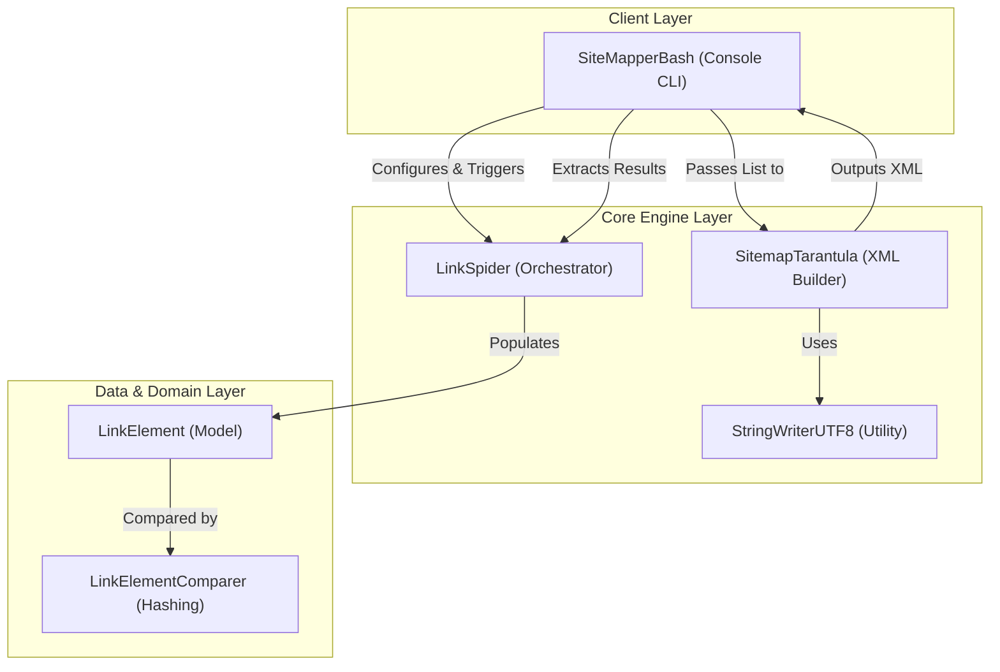
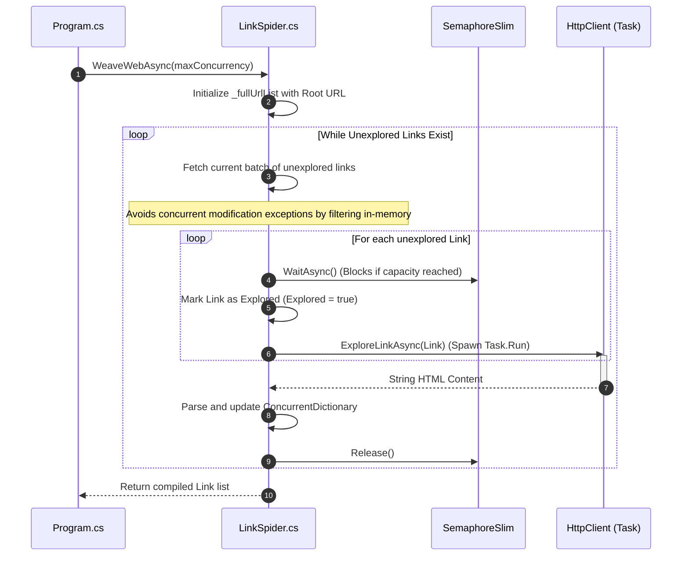
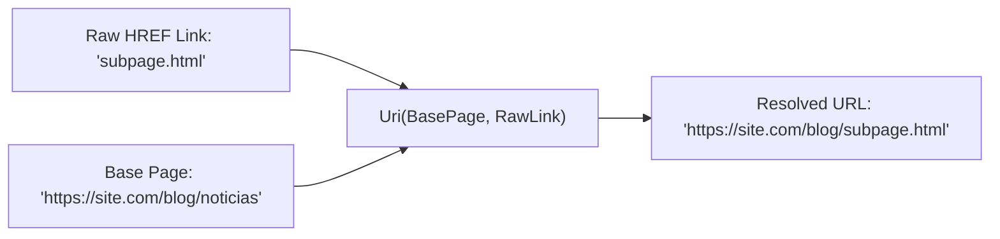

# Link Spider Architecture 📐

This document outlines the software design, asynchronous concurrency model, and core logical workflows of **LinkSpider**, modernized to **.NET 10.0** and **C# 14**.

---

## 1. High-Level System Design

LinkSpider is structured into three clean, decoupled layers adhering to the single responsibility principle:

---

## 2. Asynchronous Crawling & Concurrence Model

Unlike legacy versions utilizing thread-unsafe `HashSet` loops inside blocking `Parallel.ForEach` structures, the modernized engine operates as a non-blocking asynchronous pipeline controlled by a lightweight semaphore.

### Core Design Decisions for Concurrency
1. **`ConcurrentDictionary` Integration:** Direct, atomic `TryAdd` and value update operations ensure there are no race conditions or CPU-locking bucket corruptions when multiple HTTP requests complete at the same time and attempt to register new child links.
2. **Backpressure and Throttle (`SemaphoreSlim`):** Controls the thread pool consumption and network overhead, safeguarding the host OS from sockets exhaustion and preventing destination servers from issuing rate limits (429 Too Many Requests) or IP bans.
3. **Task-Based Parallelism (`Task.Run`):** Offloads exploration tasks to background ThreadPool threads cleanly, enabling the UI or orchestrator thread to remain fully responsive.

---

## 3. Dynamic Relative URL Resolution

Parsing relative links on a crawler is notoriously prone to errors if solved purely via string manipulation. LinkSpider handles this elegantly using the standard, fully-compliant .NET `Uri` constructor:

$$\text{Resolved URI} = \text{new Uri}(\text{Base Page URI}, \text{Relative HREF String})$$

This guarantees:
- Correct folder and absolute-path resolution.
- Native stripping of complex query strings, directory transversals (`../`), and standard port mapping.
- Automatic exclusion of cross-domain external endpoints by comparing `.Host` tags natively.

---

## 4. Modern C# 14 Syntactic Elements

The codebase has been refactored to employ advanced language semantics:
*   **Field-Backed Properties (`field` keyword):** Used in `LinkElement.Url` and `LinkSpider.URLExplorationFilter` to dynamically trim values and prevent null references on auto-properties without manual private backing fields.
*   **File-Scoped Namespaces:** Reduces deep nesting and keeps file structure cleaner (`namespace LinkSpiderLib;`).
*   **Primary Constructors:** Adopted in `SitemapTarantula` for clean, boilerplate-free dependency injection.
*   **Collection Expressions:** Used `[]` for arrays and inline list instantiations, optimizing memory footprint.
*   **Sealed Internal Classes:** Marks helper classes like `StringWriterUTF8` as `sealed` to allow the JIT compiler to devirtualize calls for peak performance.
*   **Required Properties:** Employs the `required` modifier on model properties like `LinkElement.Url`, enforcing compiled-time safety during object creation.
